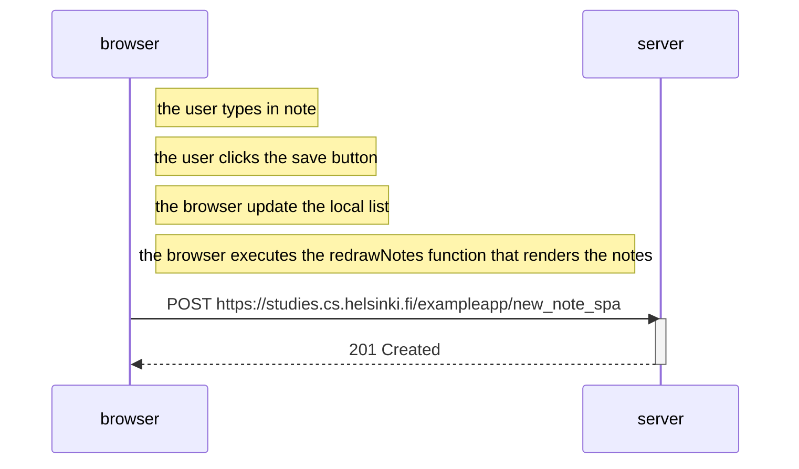

```mermaid
sequenceDiagram
    participant browser
    participant server

    Note right of browser: the user types in note

    Note right of browser: the user clicks the save button

    Note right of browser: the browser update the local list

    Note right of browser: the browser executes the redrawNotes function that renders the notes

    browser->>server: POST https://studies.cs.helsinki.fi/exampleapp/new_note_spa
    activate server
    server-->>browser: 201 Created
    deactivate server
```
